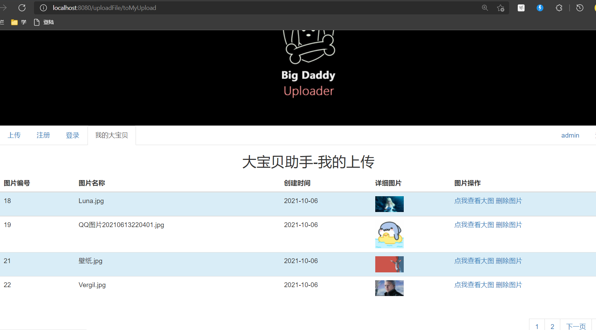

github远程仓库地址:

已部署的地址：

# 需求分析

主要就是用户模块和文件上传模块

## 用户模块

- 登录

  已经登录无法再次重复登录

  没有登录就不让你上传文件

  登录用户名不存在-则信息回显 重新回到登录界面

  登录密码错误-则信息回显 重新回到登录界面

- 注册

  已经登录无法再次注册

  除了用户名不能重复其他没啥要求

- 注销

  点击注销按钮退回到登录界面

## 文件模块

- 展示所有文件
- 删除指定文件
- 查看文件大图

# 数据库表设计

一共两张表，user和upload_file

user用户表


upload_file上传文件表----持有userId的外键


# 用到的和学到的技术

## 前端

HTML CSS JS

BootStrap

## 后端

SpringBoot（<font color='red'>快速构建</font>）

Thymeleaf模板引擎（<font color='red'>前后端分离青春版</font>）

Mybatis-Plus（<font color='red'>自动生成简单SQL+分页插件+Wrapper条件查询多表连接查询</font>）

数据源：Druid

## 部署

Docker容器化部署（<font color='red'>这个之前一直拖着现在终于学了一下</font>）

# 前端页面

## 点击按钮上传


## 鼠标移入变色动画（这个图片不好展示）


## 导航栏


# 用户模块-实体类

```java
public class User {
   @TableId(type = IdType.AUTO)
   private Integer id;
   private String username;
   private String password;
   private  String email;
}
```

# 用户模块-登录

用户根据注册的账号和密码进行登录，如果不登录，显示的是欢迎 游客；如果登录了，显示的是欢迎 用户名

## 用户没登录


## 用户名不存在


## 用户名存在但是密码错误


## 用户正确登录了


## 用户登录了还搁着登录，错误信息回显


## 用户没登录就想着去上传，先给我去登录


# 用户模块-注册

用户根据用户名，密码和邮箱进行注册

## 用户已经登录则不让注册


## 未登录才可以注册


## 注册的用户名已经存在了（唯一）


# 用户模块-注销

## 注销后退回到登录界面


# 文件模块-实体类

```java
@TableName("upload_file")
public class UploadFile {
@TableId(type=IdType.AUTO)
     private  Integer id;
     private  String name;//对应本地磁盘路径下的文件名
     private Date date;
     private  Integer userId;
}
```

# 文件模块-展示某个用户所有的上传的文件

## 每次点击`我的大宝贝`就查询属于该用户的所有文件信息（包括名称，编号，创建日期）并渲染


# 文件模块-分页条

## 前端BootStrap+Thymeleaf模板引擎根据后端返回总记录数渲染数据


# 文件模块-点我查看大图

## 用户在页面上点击查看大图，展示详细大图


# 文件模块-删除图片

## 用户点击某个文件删除按钮，删除之后回到删除之前所在的页面



